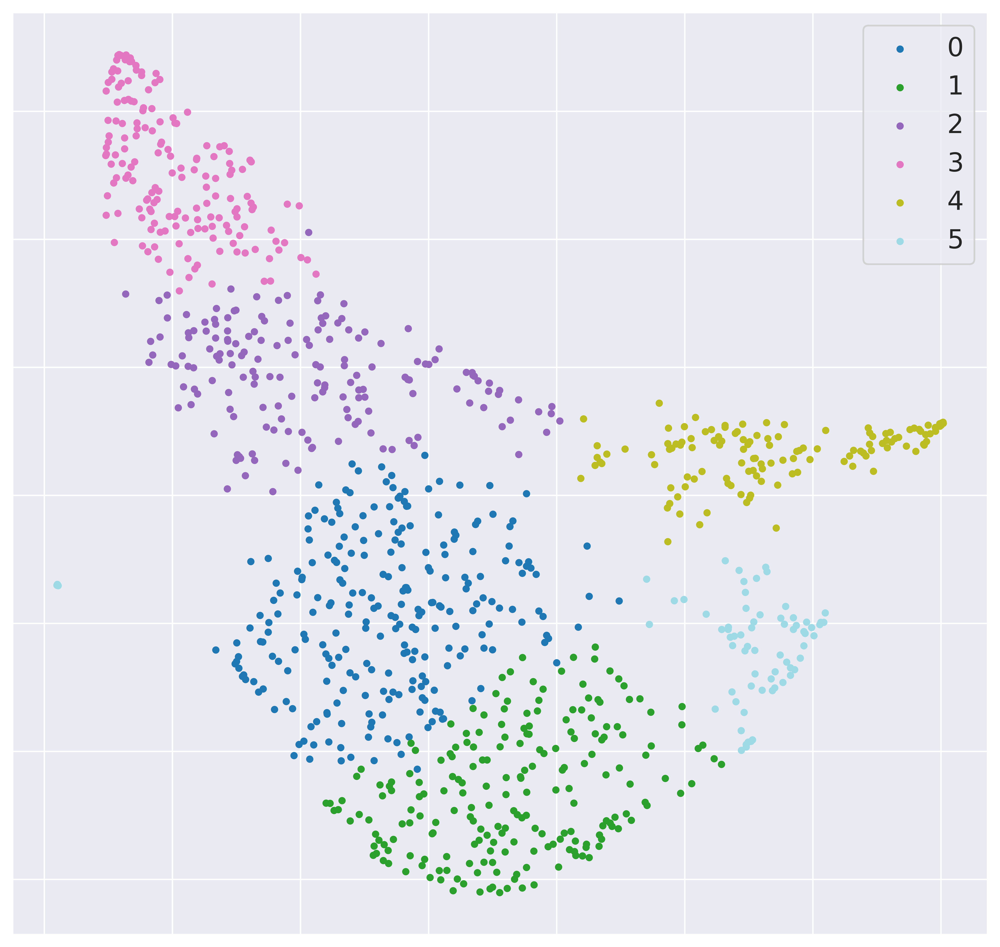
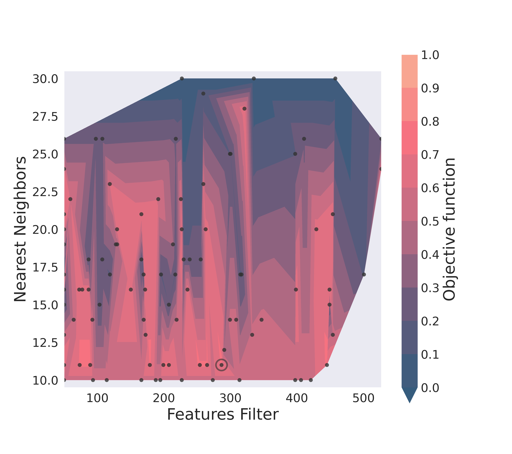

==========
Clustering
==========

A wrapper function (:code:`cluster`) is available for the user's convenience,
it takes all arguments available to the clustering object and will output the
membership assignment.

To have more control over the algorithm, one can initialize the clustering object
and call the iteration by themselves.

.. code-block:: python

  from aroughcun.clustering import iterativeClustering
  
  obj = IterativeClustering(data, **kwargs)
  obj.iterate()
  
:code:`IterativeClustering` takes an initial matrix-like object 
(rows as samples, columns as features), and some optional flags,
including a matching list of labels 
for plotting (:code:`labs`).

It contains information on the chosen clustering options
and a one-hot-encoded pandas data frame containing structure
and assignment of the hierarchy of identified classes.  

.. code-block:: python

  obj.clusOpt

The numerous flags available to :code:`IterativeClustering` 
allows for great flexibility in the clustering analysis.

Among these we find

================  ================================================================= 
:code:`maxdepth`  sets the maximum depth at which the clustering is allowed to go,
                  if :code:`None` (default) the iterative process will proceed until 
                  other conditions for its termination are met.
:code:`savemap`   if active, trained maps, preprocessing status and feature filters 
                  will be saved to disk
:code:`outpath`   set the path to a directory where all the plots and output data 
                  will be stored
================  =================================================================

For the full list of available options and their use, see :ref:`api`.

Normalization
==============

As a first step in the clustering analysis, the data can be normalized by activating the
:code:`norm` flag in the iterative clustering object. It takes default :code:`sklearn`
norms, and is set by default at :code:`'l2'`. If :code:`None`, no normalization will be applied before the features removal step.

Optimizers
==========

There are currently two native optimizers, to be set with the :code:`optimizer` flag.
A third option, :code:`htune` allows you to use the hyperparameters optimization
algorithms implemented in Ray Tune.

===============  ============================================================  
:code:`'grid'`   **Grid Search**: given a set of parameters ranges and steps, 
                 the tool will evaluate all possible combinations
                 on the defined mesh
:code:`'de'`     **Differential Evolution**: a simple evolutionary algorithm,
                 it requires setting a number of candidates for the parametric 
                 space search and a number of maximum iterations [Storn1997]_
:code:`'htune'`  **Hyperparameters Optimization**: this flag allows you to 
	         to run a hyperparameters optimization with Tune_.
                 It requires setting a number of candidates for the parametric 
                 space search and a search algorithm.
===============  ============================================================

While Grid Search requires defining the exact set of points to explore, either directly
or indirectly by setting the explorable ranges and steps for each parameter (see the next sections), 
Differential Evolution requires some candidate points to be set with :code:`search_candid`
and maximum iterations :code:`search_iter` which will stop the optimization unless a solutions 
improvement tolerance limit (set by default) is hit. 

*Warning*: These two flags will override the parameters selection flags specific to each of the downstream steps. 
It will only keep information on their ranges (if set), to define the boundaries.

While Differential Evolution is in principle more efficient than Grid Search, it is not guaranteed
to find the absolute minimum, and the results heavily depend on how extensive the search is.
For exploratory runs, with a low number of search points, Grid Search is preferred. Differential Evolution
should be the default choice when resources for a detailed search are available.

Selecting :code:`htune` will allow you to run a hyperparametrs search with Tune_. Again,
the number of maximum candidate points to evaluate can be set with :code:`search_candid`, 
but the search will stop automatically after a few iterations if a plateau is reached.
Any `search algorithm`_ included in Ray can be provided through :code:`suggest`. If none are provided,
Tree Parzen Estimators (TPE) with Hyperopt_ will be used.

A fourth option :code:`auto`, will automatically switch between grid search and differential evolution
depending on the size of the dataset at each iteration step and, consequently, the candidates pool. 
The dynamic mesh with :code:`dynmesh` needs to be active when 
this option is chosen.

Dynamic Mesh
------------

The iterative search can easily become cumbersome with large datasets.
Decreasing the number of explored points during the optimization, however, may hinder
the convergence towards a point of absolute optimality and lead to the loss
of important details.
For this reason, we implemented a dynamic mesh, which automatically attempts to adapt
the granularity of the search at each iteration. 
By setting :code:`dynmesh` as :code:`True`, the number of grid points (or candidates
and iterations in the case of DE) are calculated as a function of the population of the 
investigated cluster.

*Warning*: Activating this function will override the chosen step or candidates/iteration numbers.

Objective Function
------------------

To drive the optimization, different clustering evaluation scores can be used

====================  ============================================================  
:code:`'silhouette'`  **Silhouette Score**: measures the ratio of the intra-cluster 
                      and inter-cluster distances, it ranges between 1 for optimal
                      separation and -1 for ill-defined clusters. [Rousseeuw1987]_
:code:`'dunn'`        **Dunn Index**: is the ratio of the minimum inter-cluster 
                      distance and the maximum cluster diameter. It ranges from 0
                      to infinity. [Dunn1973]_
====================  ============================================================

These scores require measuring the distances between points and/or clusters
in the embedded space. With :code:`metricC`, one can select which metric to use.
Standard measures, as implemented in :code:`sklearn` 
(e.g. :code:`'euclidean'` or :code:`'cosine'`) are available.

When :code:`'silhouette'` is selected, its mean value on all data points is maximized. 
To assure quality in the library's outputs, sets of parameters
generating a negative score are automatically discarded.

*Warning*: the current implementation of the Dunn Index is not
well optimized, avoid it unless necessary.

Alternatively, a custom scoring function can be provided. It must have  compatible
format, following that o of scikit-learn's :code: `silhouette_score`. It should
take as inputs a feature array and an array-like list of labels for each sample. 
It should also accept a scikit-compatible metric with the :code: `metric` flag.

Population Cutoff
-----------------

The iterative search will be terminated under two conditions: if the optimization found a 
single cluster as the best outcome or if the population lower bound is met.
The latter can be set with :code:`popcut` and should be kept as high as possible to avoid
atomization of the clusters, but low enough to allow for the identification of subclasses.
(depending on the dataset, the suggested values are between 10 and 50).

Low-information Filtering
=========================

These are the methods currently available for low-information features filtering:

===================  ========================================================================== 
:code:`'variance'`   **Variance** : after ordering them by variance, remove the features
                     that fall below a cut-off percentage of cumulative variance
:code:`'MAD'`        **Median Absolute Deviation**: like :code:`variance` but with MAD instead 
:code:`'t-SVD'`      **Truncated Single Value Decomposition**: applies t-SVD to the data, 
                     requires to set the number of output components [Hansen1987]_ 
===================  ==========================================================================  

Although this step is not strictly necessary to run UMAP, it can considerably improve the outcome
of the clustering, by removing noise and batch effects emerging in the low information features.

All these methods are set with :code:`filterfeat` and require a cutoff, a percentage of the cumulative variance/MAD to be removed, or 
the number of output components in t-SVD. 
This is a tunable parameter and is part of the optimization process, its range and step
can be set with :code:`ffrange` and :code:`ffpoints` respectively.

For example, setting 

.. code-block:: python

  filterfeat = 'MAD'
  ffrange = 'logspace'
  ffpoints = 25

will run the optimization on a logarithmic space between .3 and .9 in cumulative
MAD with 25 mesh points.

This step can be skipped by selecting 'variance' or 'MAD', while setting the percentage
of cumulative variance to be kept at 100% as the only explorable point.

.. code-block:: python

  filterfeat = 'variance'
  ffrange = [1]

Dimensionality Reduction
========================

Following the low-information features removal is the dimensionality reduction through UMAP.
Here there are several flags that one could set, mostly inherited by UMAP itself, the
most important being :code:`dim`, the dimensionality of the target space.
One should take particular care in choosing this number, as it can affect both
the results and the efficiency of the algorithm. The choice of metric for the objective 
function will also depend on this value, as :code:`'euclidean'` distances are only viable in two 
dimensions.

We suggest you leave the choice of mapping metric (:code:`metricM`), the number of epochs (:code:`epochs`) 
and learning rate (:code:`lr`), to their default values unless you know what you are doing.

Finally, as in the case of the features removal step, the number of nearest neighbours,
which defines the scale at which the dimensionality reduction is performed, is left as tunable
by the optimizer. You can choose the range and the number of points (if Grid Search is active) with
:code:`neirange` and :code:`neipoints` respectively.
If the range is left to be guessed automatically, for example as a logarithmic
space based on the population (:code:`'logspace'`), a factor can be set to reduce the 
value proportionally (:code:`neifactor`) in the presence of particularly large datasets,
as high values of these parameters can impact the performance considerably.

If the dimensionality of the target space corresponds to the dimensionality of the input space
(after the low-information filter), this step will be skipped by default. This helps speeding 
up the process by avoiding unnecessary calculations and it can be used in those cases where you 
want to avoid running the dimensionality reduction step on your data. 
If for any reason you still want to transform your data, you can set :code:`'skip_equal_dim'`
to :code:`False`.

Clusters Identification
=======================

The clusters identification tool is chosen with the :code:`clu_algo` flag

=================  ================================================================  
:code:`'DBSCAN'`   **Density-Based Spatial Clustering of Applications with Noise**: 
                   density-based clustering, requires an :math:`$\epsilon$` 
                   distance to define clusters neighbourhood [Ester1996]_
:code:`'HDBSCAN'`  **Hierarchical DBSCAN**: based on DBSCAN, it attempts to remove
                   the dependency on :math:`$\epsilon$` but is still affected by 
                   the choice of minimum cluster population [Campello2013]_
:code:`'SNN'`      **Shared Nearest Neighbors**: it accounts for clusters of varying
                   density by building an adjacency matrix based on the number of
                   neighbours within a given threshold. This implementation relies
                   on DBSCAN to find the clusters from the similarity
                   matrix. [Jarvis1973]_
:code:`'louvain'`  **Louvain Community Detection**: this is an algorithm devised
                   for the identification of communities in large networks. This  
                   implementation is based on the adjacency matrix calculated
                   with SNN. [Blondel2008]_
=================  ================================================================

Depending on which method has been chosen, different parameters are set as tunable for 
the optimizer (e.g. :math:`$\epsilon$` for DBSCAN or minimum population for HDBSCAN).
With :code:`cparmrange` one can set the range to be explored. By default, this is set
as :code:`guess` which allows the algorithm to find an ideal range based on the elbow method.

If :code:`'DBSCAN'` is chosen as clustering algorithm, its minimum value of cluster size can also be set
with :code:`minclusize`.

This step is also affected by the choice of :code:`metricC` as distances need to be measured
in the embedded space.

For those clustering algorithms that allow discarding points as noise, the :code:`outliers`
flag allows the user to chose what to do with these points:

==================  ================================================================  
:code:`'ignore`     points marked as noise will be left as such and discarded at the 
                    next iteration.
:code:`'reassign'`  attempts to force the assignment of a cluster membership to all 
                    the points marked as noise by means of nearest neighbours.
==================  ================================================================

Given that this step is in most cases considerably less expensive than the other two, 
and that the DE algorithm efficacy is considerably reduced above 2 dimensions, the 
search for this parameter is set by default as a Grid Search with fine mesh.

Transform-only data
===================

Occasionally you may want to train your clusters only on a subset of the data, while still
use them to classify some held-out set.

By setting :code:`transform` you can ask the algorithm to run each one of the clustering steps
iteratively only on a given subset, while still forcing the membership assignment with k-NN 
to the rest of the data.

The full dataset has to be given as input, including the data to project, but not used in the training.
:code:`transform` takes a list-like object containing the indices of the points *not* to be used
for the training.

Activating this function will produce extra plots at each iteration, of projection maps 
colour-coded according to which points were used for the training and which transformed only.

Supervised clustering
=====================

The :code:`supervised` boolean flag activates supervised dimensionality reduction with UMAP. When this flag is active, class labels need to be provided in :code:`labs`
and are used to guide the training of the lower dimensionality spaces. You can tune how much the supervised information will affect the training with :code:`supervised_weight`, which corresponds to the :code:`target_weight` flag in UMAP. This is to be set to 0.0 to ignore the labels, or 1.0 to fully rely on them. By default, it is set as 0.5.

Saving hierarchy information
============================

The resulting clustering membership will be stored as a one-hot-encoded pandas data frame in the :code:`obj.clusOpt` variable.
However, auxiliary functions are available to store the hierarchy information as an :code:`anytree` object as well.

.. code-block:: python
  
  import aroughcun.utils.trees as trees

  tree = trees.buildTree(obj.clusOpt)

:code:`buildTree` requires the membership assignment table as input and optionally a path to where to save the tree in :code:`json` format.
By default, it will be saved in the home directory of the run.
To load a tree from the :code:`json` file :code:`loadTree` only requires its path.

Plotting
========

Each run will produce a series of plots, which can be found in the :code:`raccoon_plots` folder.
These will include 2d UMAP projections of the subset selected at each iteration, colour-coded by class and by label (if provided).

And an optimization surface built from the explored sets of parameters. This plot shows a colour map of the objective function best score
as a function of the number of neighbours and the feature filters parameter value. Each set of parameters tested is a dot, the chosen
optimal set is circled in black.

Resuming a run and checkpoints
==============================

It is possible to resume a previously interrupted run (or one which completed successfully in case you want to deepen the hierarchy), 
with the wrapper function :code:`resume`. This takes the same inputs as :code:`cluster`.
:code:`chkpath` is needed in its place. This should point to the :code:`raccoon_data` folder where the instance to be resumed was run.

.. code-block:: python
  
  import aroughcun as rc

  cluster_membership, tree = rc.resume(data, lab=labels, dim=2, popcut=20, maxdepth=3,
                                     chkpath='path_to_original_run', savemap=True)

To resume, the original run needs checkpoint files. To create them, activate the :code:`chk` boolean flag during your original run. 
This will automatically build a :code:`chk`  subdirectory in the data folder and populate it with temporary class assignments. 
While saving checkpoints may affect the efficiency of the run, it is recommended for
larger jobs to avoid losing all progress if something were to go wrong. 

When resuming a run, all new data will be saved in the original directory tree.

:code:`resume` takes most of the same arguments as :code:`cluster`, you are free to change them,  
e.g to allow for a finer or deeper search by decreasing :code:`popcut` or increasing :code:`maxdepth`. The algorithm will automatically search for all
candidate classes and extend the search. This includes classes higher up in the hierarchy that fell below the population threshold. 
Classes that were discarded as noise by the clustering algorithm or were below the :code:`minclusize` cutoff
cannot be recovered.

References
----------
        
.. [Storn1997] Storn R. and Price K. (1997),  "Differential Evolution - a Simple and Efficient Heuristic for Global Optimization over Continuous Spaces", Journal of Global Optimization, 11: 341-359.
.. [Rousseeuw1987] Rousseeuw P. J. (1987), "Silhouettes: a Graphical Aid to the Interpretation and Validation of Cluster Analysis", Computational and Applied Mathematics, 20: 53-65.
.. [Dunn1973] Dunn J. C. (1973), "A Fuzzy Relative of the ISODATA Process and Its Use in Detecting Compact Well-Separated Clusters", Journal of Cybernetics, 3: 32-57.
.. [Hansen1987] Hansen, P. C. (1987), "The truncatedSVD as a method for regularization", BIT, 27:,: 534–553. 
.. [Ester1996] Ester M., Kriegel H. P., Sander J. and Xu X. (1996), “A Density-Based Algorithm for Discovering Clusters in Large Spatial Databases with Noise”, Proceedings of the 2nd International Conference on Knowledge Discovery and Data Mining, 226-231.
.. [Campello2013] Campello R. J. G. B., Moulavi D., Sander J. (2013), "Density-Based Clustering Based on Hierarchical Density Estimates, Advances in Knowledge Discovery and Data Mining", PAKDD  Lecture Notes in Computer Science, vol 7819.
.. [Jarvis1973] Jarvis R. A. and Patrick E. A. (1973) "Clustering Using a Similarity Measure Based on Shared Near Neighbors", IEEE Transactions on Computers, vC-22 11: 1025-1034.  
.. [Blondel2008]  londel V. D., Guillaume J-L., Lambiotte R. and Lefebvre E. (2008), "Fast unfolding of communities in large networks", Journal of Statistical Mechanics, P10008.
.. _Tune: https://docs.ray.io/en/latest/tune/index.html 
.. _`search algorithm`: https://docs.ray.io/en/latest/tune/api_docs/suggestion.html?highlight=suggest
.. _Hyperopt: http://hyperopt.github.io/hyperopt/
