.. _tutorial:

MNIST: using raccoon to cluster handwritten digits
==================================================

In this tutorial we will attempt to build a hierarchy of clusters from the popular MNIST dataset using basic raccoon functionalities.
In the last sections we will use this hierarchy to build a k-NN classifier.

You can follow these steps as a template for the clustering analysis of any of your datasets. 
See the `manual <https://github.com/>`_ for more features and options.

Dataset
--------------

As a first step we can use :code:`Keras` (not required by raccoon) to download or the `MNIST <http://yann.lecun.com/exdb/mnist>`_ dataset, 
and subset it to speed up the whole process. 
We download both the data and their labels, although this clustering is fully unsupervised, we can use this information 
to validate the classes ant their hierarchy.

.. code-block:: python

   import pandas as pd
   from keras.datasets import mnist

   nSamples = 25000
   seed = 32

   (x_train, y_train), (x_test, y_test) = mnist.load_data()
   x_train = x_train.reshape(x_train.shape[0],x_train.shape[1]*x_train.shape[2])
   inputDf = pd.DataFrame(x_train).sample(nSamples,random_state=seed)
   labels = pd.Series(y_train).sample(nSamples,random_state=seed)

we reformat the input and its labels into :code:`pandas` object, the library is able to work with any array-like format, 
but :code:`pandas` dataframes will make our life easier. We also fix the random state seed for debugging purposes.

Recursive clustering
--------------------

As our input is ready to go, we can now use it to run our first recursive clustering instance. Details on all the flags available to the :code:`run` function can be found in the manual, 
here we select some default values as explained in the follwing paragraphs. 

.. code-block:: python

  import raccoon as rc 

  clusterMembership = rc.run(inputDf, lab=labels, dim=2, popcut=50, 
                      filterfeat='tSVD', optimizer='de', depop=25, deiter=25,  
                      neifactor=0.5, metricC='euclidean', metricM='cosine',  
                      outpath='./raccoonOutputs/', savemap=True) 

this function will automatically take care of initialising the clustering object and run it for us, it just requires the selection of which kind of tools to use.

Here we input the data, followed by their labels. As mentioned above, the :code:`lab` flag is optional, and is only used to output scatter plots colorcoded according to the orgiinal 
labels, if any are present. It can help in the annotation of the clusters if full or partial information is available. Make sure that the labels have corresponding indices to the input data, or, 
if you are using an array-like format, make sure the order of your datapoints an labels is matching. 

The :code:`dim` parameter sets the dimensionality of the target space. As we go towards less and less dimensions, we start introducing artefacts (tears and deformations)
in the embedding, but the cost to identify the clusters and compute the objective function also decreases, making the calculations more efficient.
When chosing this parameter one should weight accuracy against cost. Here, for demonstration purposes we chose to reduce our space to only two dimensions. This also allows us to chose :code:`metricC='euclidean'` 
as the metric for the clusters identification and speed up considerably the calculations. When working with higher dimensions, metrics that handle >2 dimensions better (e.g. :code:`'cosine'` distance) should be used instead. 
:code:`metricM` sets the metric used for the non-linear dimensionality reduction step and should be left as by default unless you really know what you are doing.
.. add plot to show

*Note*: When working with higher-dimensionality embedding, the library will keep producing two-dimensional plots to help with visual inspection of the results if the plotting 
function is set as active (default).

We chose truncated Single Value Decomposition (t-SVD) as low-information filter in :code:`filterfeat`. This is a linear transformation that allows us to easily identify and remove
components carrying less variance. We leave the choice of how many components to keep to the optimizer itself. We could manually set shape and size of the range of features to consider during the optimization 
by setting the :code:`ffrange` and :code:`ffpoints` flags, but we leave them to their default values, since we will be using Differential Evolution as our optimizer, for which they bear much less importance.

Similarly, we leave the values for the clusters identification parameter(:code:`cparmrange`) 
and for the UMAP nearest neighbours choice (set by :code:`neirange` and :code:`neipoints`) as default. The only exception is the scaling factor for the number of neighbours :code:`neifactor`, here reduced to speed up the search. 
If you have time and a powerful enough machine, we suggest you to leave it as default to :code:`1`.

There are currently two optimizers implemented, Grid Search (:code:`optimizer='grid'`) and Differential Evolution (:code:`optimizer='de'`). While the former 
evaluates the clustering along a mesh defined by all possible combinations of the chosen parameters values, the latter tries to follow the shape of the objective function shape to converge faster to a minimum. 
Differential Evolution is a quick and intuitive genetic optimization algorithm, on a large enough search space it can outperform Grid Search, but it is not guaranteed
to identify the absolute minimum if the number of candidate points and iterations is set too low. For very cheap and quick runs, Grid Search should be selected instead.  
With :code:`optimizer='de'` we need to set two more parameters, the number of candidates for the search :code:`depop` and the number of maximum iterations :code:`deiter`. 
Here, 25 for both is reasonable choice.
.. add citations  

Finally, :code:`run` will return a dataframe with a one-hot-encoded clusters membership for the input datapoints and it will save important information to disk, in the chosen
output folder. Subdirectories will be automatically built to store plots and data, if the output path already contains a previous raccoon run, a prompt will ask you if you wish to delete them or interrupt the operation.
If :code:`outputpath` is not explicitly given, the directory where the script is run will be set as home.
We also activate :code:`savemap`, asking the algorithm to save the trained UMAP objects. These can require quite a bit of disk space, but will came in handy when we build the nearest-neighbour classifier.

.. Manually running the clustering, to add in another section
    obj = recursiveClustering(data, **kwargs) 
    obj.recurse()
	obj.clusOpt

Keeping track of your run
-------------------------

As the :code:`run` function does it's job it will populate a log file in the chosen output folder. 
It should look something like this:

.. code-block:: bash

	2020-06-16 10:05:05,983 INFO     Dimensionality of the target space: 2
	2020-06-16 10:05:05,984 INFO     Samples #: 1000
	2020-06-16 10:05:05,984 INFO     Running Differential Evolution...
	2020-06-16 10:06:00,452 INFO     Epsilon range guess: [0.00362,0.27113]
		...
	2020-06-16 11:59:38,647 INFO     Tolerance reached < 1.000000e-04
	2020-06-16 11:59:38,882 INFO     Done!
	2020-06-16 11:59:38,883 INFO
	=========== Optimization Results 0 ===========
	Features # Cutoff: 254.66880
	Nearest neighbors #: 31
	Clusters identification parameter: 0.38990
	Clusters #: 10

with information on which parameters were explored and which were chosen as best fit.

Or occasionally

.. code-block:: bash

	2020-06-16 16:20:37,253 INFO     Going deeper within Cluster # 0_8 [depth: 0]
	2020-06-16 16:20:37,253 INFO     Population too small!

if the algorithm met one of the conditions to stop the recursion; in this case a too small population.
To prevent the user from being inundated by information, most of this data produced by the optimization steps is set as debug only. 

*Note* the :code:`debug` flag allows the script to be run in debug mode. This will fix the random seed for reproducibility and will add extra information to the logfile.

As the run proceeds, a comma-separated file :code:`paramdata.csv` should appear in the data folder and be periodically updated. 
This file contains a table summarizing the optimized parameters, scores and other information
regarding each recursion step.

Outputs
-------

Now that the run instance finished its job we can start looking at the results.

If we open our clusterMembership we can see to which classes each datapoint is assigned to. The structure is hierarchical and multilabelling is present. 
As for the naming convention, we assign :code:`'0'` to the full dataset and maintains information on the parent classes at each level. 
In this way, the first classes identified, children of :code:`'0'` will be called :code:`'0_0', '0_1', ...`,
while the children of :code:`'0_2'` will be :code:`'0_2_0', '0_2_1', ...`.

.. insert finalOutput here

In the plot folder we find two-dimensional projection of our dataset at different steps of the recursion. They are color coded by cluster or by label (if provided). 
Depending on which parameters were selected, you may also find other plots justifying the choice of clustering or feature filtering parameters.

In the data folder we find the trained UMAP embeddings and feature filter functions (in :code:`pickle` format), useful to resume or repeat parts of the process.
And the coordinates of the datapoints in the reduced space as pandas dataframe (in :code:`hdf5` format) for plotting purposes. One of each files is produced at each recursion step
and the nomenclature follows that of the output membership assignment table: the prefix :code:`'0'` relates to embedding and files at the highest level of the hierarchy, 
:code:`'0_0', '0_1', ...` to the data within its children. 

MNIST Clusters
--------------

And what about our MNIST dataset? We can now use all this data 
to see if the clustering was succesful and try to interpret the 
identified classes.

.. image:: figs/proj_0.png
  :width: 500

Here we are looking at a two dimensional projection of our full dataset color-coded according 
to the clusters identified (top) and then their original labels (bottom).
We can see that the algorithm identified 6 different clusters that overlap very well with the labels.
We see that most digits form a distinct, cleanly defined group and end up forming theoir own class in the hierarchy.
For example :code:`'0_0'` is mostly made up of digits representing 6, while :code:`'0_6'` comprises 1.
Looking at the bottom image we can see a certain degree of noise, certain digits do not go where
they are expected to go, we see that in :code:`'0_3'` there are some sevens, fours and a few twos (in grey, purple and green respectively).
However, if we take a look at these specific cases we can see that this choice is completely justified.

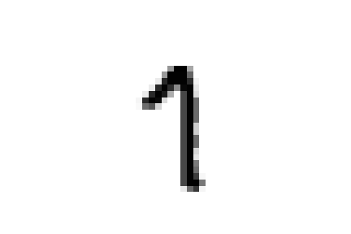

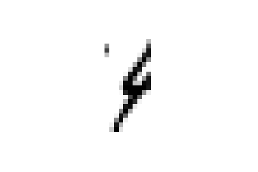

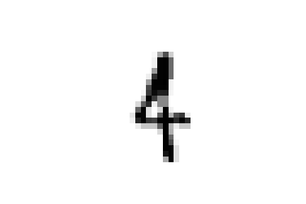

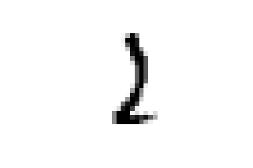

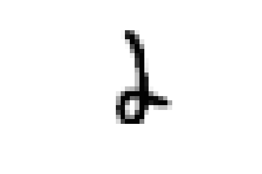

these samples are all closer to ones in the embedded space and could all be easily confused for ones  
Or again, we see a few nines and sixes in :code:`'0_5'` which contains zeroes.

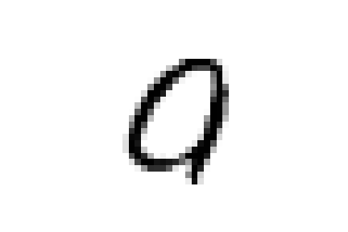

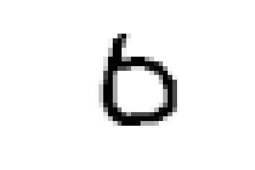

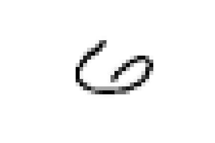

And as expected they are all characterized by wide round cirles as their most characterizing element.

There are however two major exceptions to our classes, :code:`'0_1'` and :code:`'0_2'` 
(in green and orange in the plot at the top) do not, for the most part,
contain only a specific digit type, but are rather composite clusters.

:code:`'0_1'` is made up of a group of sevens, and and overlapping clouds of nines and fours, while :code:`'0_2'` contains threes, fives and eights.
The commonality of their shapes (e.g. the latter are all characterized by a rounded stroke at the bottom)
justifies their inclusion in a single class. However, the recursion allows us to dig deeper and see if they separate at the next level, hilighting the importance
of having a hierarchy of classes.

For the sake of brevity we will only focus on :code:`'0_2'`. At the next level we see that eights (in yellow at the bottom) are gathered in
their own specific cluster :code:`'0_2_2'` and so are part of the fives in :code:`'0_2_1'`. Owever, the remaining samples, fives and threes again 
are all clumped together in :code:`'0_2_0'`

.. image:: figs/proj_0_2.png
  :width: 500

Luckily for us the final separation between threes and five is observed at the next level, within :code:`'0_2_0'`, where we see that all
threes are found in :code:`'0_2_0_0'` and the remaining five are in :code:`'0_2_0_1'`.

.. image:: figs/proj_0_2_0.png
  :width: 500

Now we can ask ourselves, why samples representing the digit five were separated into two different classes found at different
levels of the hierarchy. To answer this question we can compare the average shape of :code:`'0_2_1'`, the first class we encountered,
that of :code:`'0_2_0_0'` and also that of :code:`'0_2_0_1'`, which contains the threes and attracted part of the fives down it's branch.

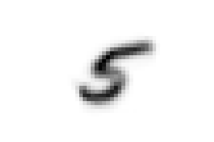

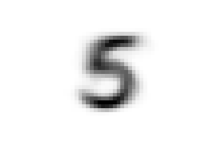

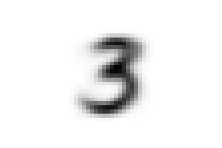

We can see that there are substantial structural differences between the two type of fives, with samples in :code:`'0_2_1'` having a much more skewed
shape, while those in :code:`'0_2_0_0'` are rounder and considerably similar to threes for their bottom half, justifying their proximity.

The choice of t-SVD as information filter, the use of density based clustering or even the range and depth of the 
parameters space exploration, all contribute to this specific result. You can try changing these parameters, 
for example by running a more detailed search, and see how the hierarchy changes.
You'll see a few rearrangements, maybe more or fewer branches and levels in the tree of clusters, 
but overall, the shape of the main clusters and their composition will be 
immutated as long as your choices are appropriate for the dataset at hand.

Building a classifier
---------------------

Finally, we can use this hierarchy of classes as target for a prediction taks.
raccoon offers an implementation of a fuzzy k-nearest neighbour classifier, it just needs :code:`pickle` files
with the trained UMAP embeddings and consistency between the format of the training and the predicted data.

*Note*: if you are using MNIST for this tutorial, make sure to download some extra samples outside of the training dataset.

To run it, we import the knn class, initialize it by passing the new data
to assign, the original training set, it's class asignment and path to the folder containing
the :code:`pickle` files. 
The results will be stored in the :code:`membership` attribute.

.. code-block:: python

	from raccoon.utils.classification import knn

	rcknn=knn(dfToPredict, df, clusterMembership, refpath=r'./raccoonData', outpath=r'./')
	rcknn.assignMembership()

	newMembership = rcknn.membership

The classifier outputs a probability assignment, 
we impose .5 as cutoff to binarize the results and plot them in the following heatmap. 

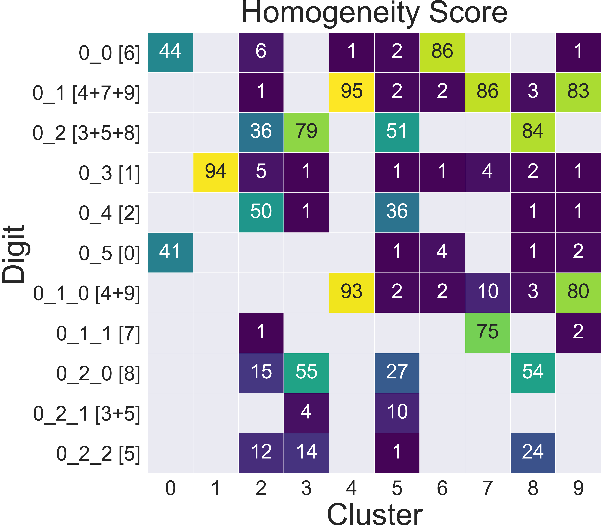

Here we are comparing the percentage of samples labelled according to a certain digit and
were they are assigned in our hierarchy. To simplify we added in square brackets a clarification 
of their actual digit population content. We limit this comparison to the first levels, for clarity.

The classifier assign most samples to the expected class,
and more than that it is able to distinguish subclasses within each digit gorup that we identified deeper in the hierarchy.
However, since this classification is based on the unsupervised classes, borderline samples as those shown before will
be assigned to the class that is most similar in the pixels space, rather than the labels that came with the dataset. 
There is value in this, as it allows us to get rid of possible errors or inaccuracies in the labelling. 
These classes fit closely the shape of the data and can be used as target classes for considerably 
more accurate classification tools (e.g. neural nets).

